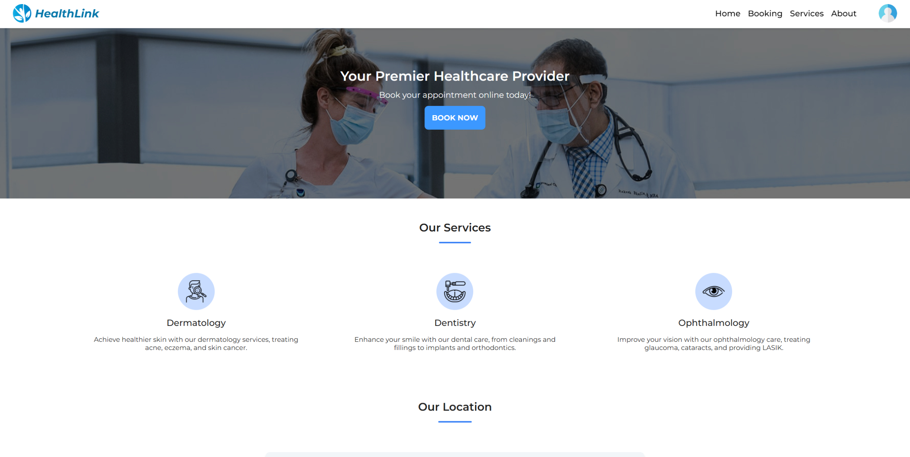
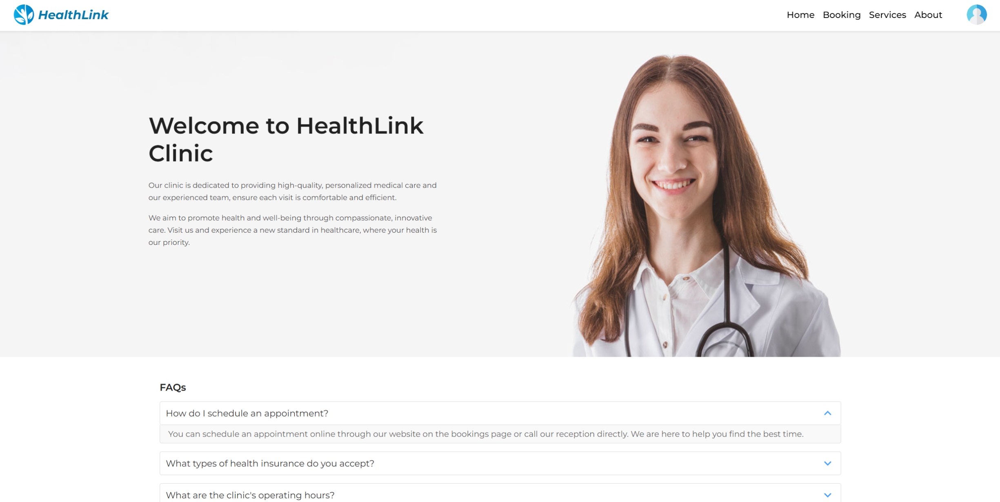
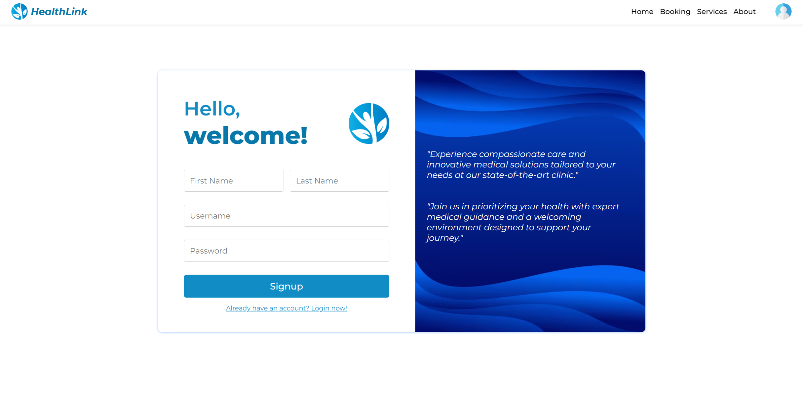
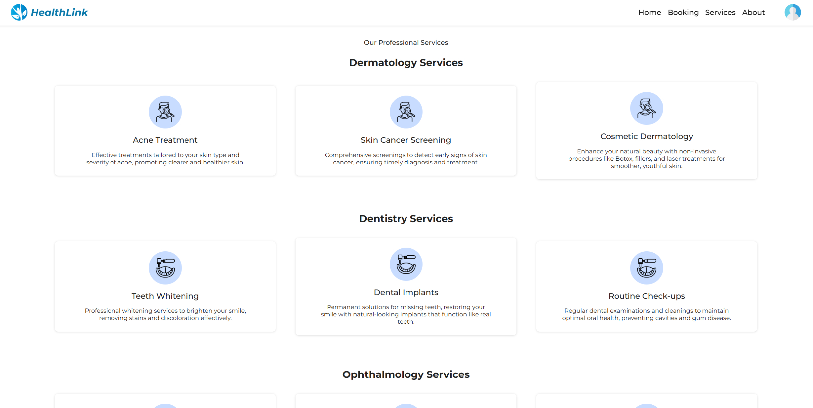
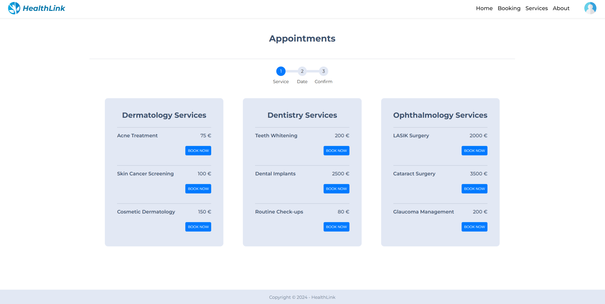
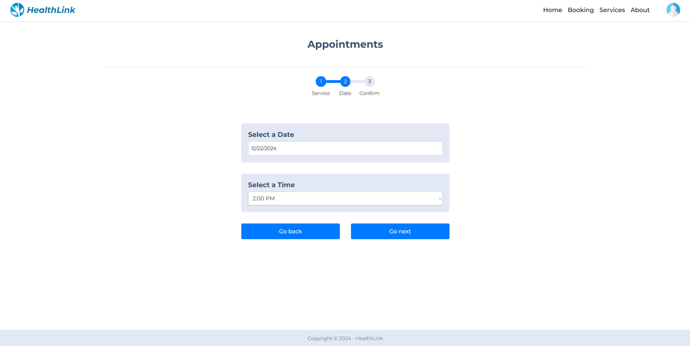
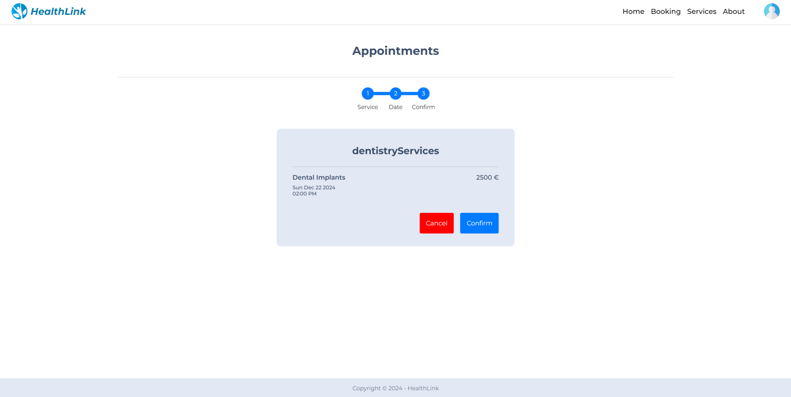
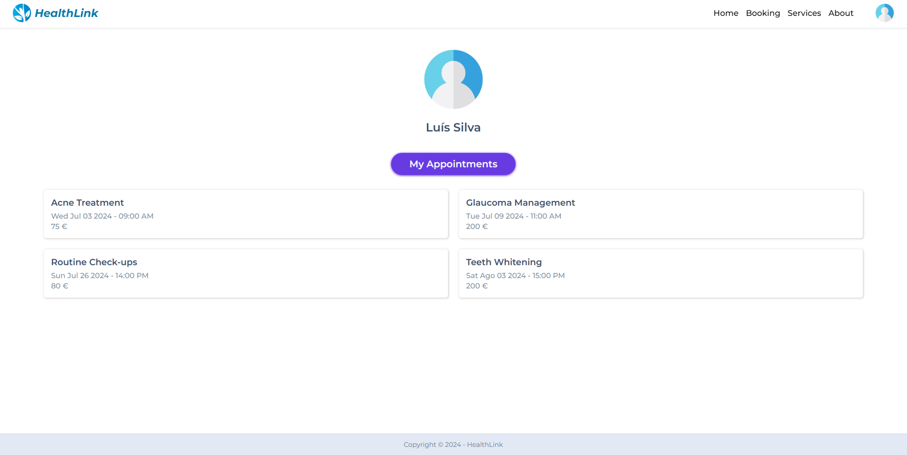

# HealthLink - Medical Appointment Booking System

## Description

HealthLink makes scheduling appointments simple and efficient. With an intuitive booking system, users can select their preferred date and time, while healthcare providers can effectively manage their schedules.

## Features

- **Appointment Booking**: Users can browse available appointments and choose their preferred date and time.
- **User Authentication**: Login and registration system, allowing users to manage their accounts.
- **Profile Management**: A profile page where users can view their booked appointments.
- **Service Information**: Users can easily explore the available medical services provided by the platform.
- **Platform Overview**: A comprehensive section providing an introduction to the platform’s features, mission, and functionality.
- **Mobile-Responsive Design**: The platform is designed to provide a seamless user experience across all devices, with a fully responsive interface.

## Technologies Used

- **React**: JavaScript library for building user interfaces.
- **HTML**: Provides the structure of the web application.
- **CSS**: Used for styling the interface.
- **JavaScript** - Used for client-side logic and interactivity.
- **LocalStorage**: Stores data locally in the browser, such as login state and appointment details.

## Link to Deployment

The HealthLink app is deployed and can be accessed at the following link:
[HealthLink Live](https://healthh-linkk.netlify.app)

## How to Run the Project Locally

### Installation Steps

1. **Clone the repository:**

   ```bash
   git clone https://github.com/LuisSilva7/healthLink-project.git
   ```

2. **Navigate to the project directory:**

   ```bash
   cd healthlink-project
   ```

3. **Install project dependencies:**

   ```bash
   npm install
   ```

4. **Start the development server:**
   ```bash
   npm run dev
   ```

The application will be available at [http://localhost:5000](http://localhost:5000) in your browser.

### Docker Setup (Optional)

If you prefer to run the application inside a Docker container, follow these steps:

1. **Build the Docker image:**

   ```bash
   docker build -t healthlink-project .
   ```

2. **Run the Docker container:**
   ```bash
   docker run -p 80:80 healthlink-project
   ```

The application will be available at [http://localhost](http://localhost) in your browser.

## Screenshots

### Home Page



### About Page



### Register Page



### Services Page



### Booking1 Page



### Booking2 Page



### Booking3 Page



### Profile Page



### Maintainer

- **Luis Silva** (Owner/Developer)
